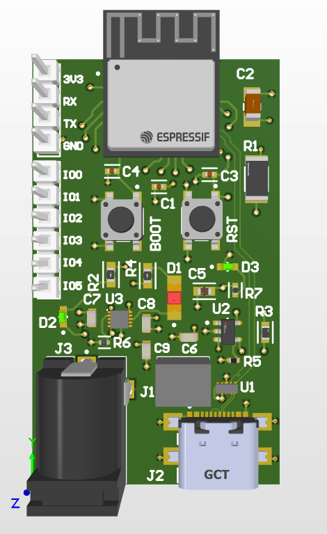

# ESP32-Battery-Charger
4-layer PCB design featuring the **ESP32-C3-MINI-1** RISC-V SoC with integrated Li-Po battery management.

## 🛠 Technical Specifications
* **Processor**: ESP32-C3-MINI-1 (RISC-V Single-Core, Wi-Fi/Bluetooth LE).
* **Layer Stackup**: 4-Layer (Signal-GND-PWR-Signal) for optimized EMI and Signal Integrity.
* **Power System**: 
    * Integrated Li-Ion Linear Charger with $500\text{mA}$ regulation.
    * USB-C Input with ESD protection and Schottky diode power-path management.
    * Dedicated **CHG** status LED tied to the charging IC.
* **High-Speed Routing**: $90\Omega$ impedance-matched differential pairs for **USB 2.0** data lines.

## 📐 Design & Layout Highlights
* **RF Optimization**: 
    * Implemented a strict 15mm antenna keep-out zone as per the Espressif datasheet.
    * Utilized ground stitching vias to create a low-impedance return path and reduce noise.
* **Thermal Management**: 
    * Designed a $3\times3$ thermal via array on the ESP32 center **EPAD** to dissipate heat into internal ground planes.
* **Manufacturing (DFM)**: 
    * Successfully resolved 50+ Design Rule Violations using targeted clearance exceptions.
    * Maintained 6mil trace/space clearance in high-density areas.

## 🏁 Design Rule Check (DRC)
* **Status**: 0 Errors / 0 Warnings.
* **Custom Rules**: 
    * Implemented `InComponent` queries to allow 1.4mil solder mask slivers on the ESP32 thermal pads while maintaining 10mil global safety clearances.

## 📁 Repository Structure
* `/Hardware`: Altium Designer project files and 3D STEP model.
* `/Manufacturing`: Production-ready Gerber and NC Drill files.
* `/Docs`: Schematic PDF and Bill of Materials (BOM).
